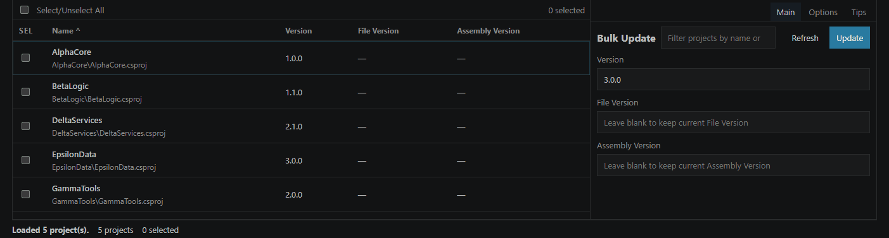

# Semic Version Changer (.NET)

Semic Version Changer (.NET) is a Visual Studio Code extension for bulk editing version-related properties across many `.csproj` files in the current workspace.

## Demo



## Features

- Scans single-root and multi-root workspaces for `.csproj` files
- Reads `Version`, `AssemblyVersion`, `FileVersion`, `ApplicationDisplayVersion`, `ApplicationVersion`, `InformationalVersion`, and `PackageVersion`
- Supports grouped updates for selected projects
- Provides a desktop-style React webview UI with filtering, sorting, details, status messages, and options
- Handles malformed XML, missing tags, duplicate entries, read-only files, and optional backup creation

## Requirements

- Node.js 20+ recommended
- VS Code 1.116+

## Development

Install dependencies:

```bash
npm install
```

Run type checks:

```bash
npm run lint
```

Build the extension host and webview:

```bash
npm run compile
```

Start local development:

1. Open the project in VS Code.
2. Run `npm run compile` at least once.
3. Press `F5`.
4. In the Extension Development Host run `Semic Version Changer: Open`.

Useful scripts:

- `npm run compile` - build webview and extension host
- `npm run build:webview` - build only the React webview
- `npm run watch` - watch extension host and webview
- `npm run watch:webview` - watch only webview changes
- `npm run lint` - strict TypeScript validation
- `npm run package` - build and create a `.vsix`
- `npm run publish:marketplace` - publish the current version to VS Code Marketplace

## Commands

- `Semic Version Changer: Open`
- `Semic Version Changer: Refresh Projects`
- `Semic Version Changer: Update Selected Projects`

## Packaging And Deploy To VS Code Marketplace

There are two common deployment paths: local `.vsix` packaging and Marketplace publishing.

### A. Create A Local VSIX Package

1. Make sure the version in `package.json` is updated.
2. Build the project:

```bash
npm run compile
```

3. Create the package:

```bash
npm run package
```

This produces a `.vsix` file in the repository root. You can install it locally with:

```bash
code --install-extension semic-version-changer-<version>.vsix
```

Or from VS Code:

1. Open Extensions view.
2. Click the `...` menu.
3. Choose `Install from VSIX...`.

### B. Publish To Visual Studio Code Marketplace

Before first publish:

1. Create a publisher in the Visual Studio Marketplace management portal.
2. Make sure `publisher` in `package.json` matches that publisher ID.
3. Create a Personal Access Token in Azure DevOps / Marketplace with Marketplace publish permissions.
4. Install `vsce` if you want to use it globally, or use the local one from this project.

Login once:

```bash
npx vsce login <your-publisher-id>
```

Publish a new version:

```bash
npm run publish:marketplace
```

Publish a specific semver bump:

```bash
npx vsce publish patch
```

Other useful variants:

```bash
npx vsce publish minor
npx vsce publish major
```

### Recommended Release Flow

1. Update the version in `package.json`.
2. Run:

```bash
npm run lint
npm run compile
```

3. Verify the extension manually in the Extension Development Host.
4. Create a local package:

```bash
npm run package
```

5. Publish:

```bash
npm run publish:marketplace
```

Note: use `npm run publish:marketplace`, not plain `npm publish`. The plain `npm publish` command is for the npm registry, not for the VS Code Marketplace.

### Marketplace Checklist

Before publishing, verify:

- `name`, `displayName`, `publisher`, and `version` in `package.json`
- command titles and descriptions
- `README.md`
- extension icon, if you add one later
- `.vscodeignore` excludes source-only files you do not want to ship
- `npm run lint` passes
- `npm run compile` passes